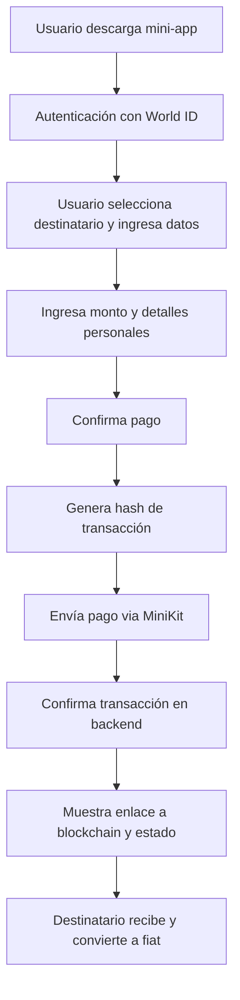

# Plan de Mejoras para Aplicación de Pagos con WorldCoin MiniKit

## Descripción General
Transformar el template de Next.js en una aplicación para enviar pagos en criptomonedas a destinatarios preestablecidos, con autenticación, verificación y conversión a fiat.

## Funcionalidades Clave
- Autenticación con World ID
- Selección de destinatario (múltiples opciones hardcodeadas inicialmente)
- Ingreso de datos del remitente (nombre, WhatsApp, cuenta bancaria)
- Generación de hash de transacción
- Enlace a explorador de blockchain (placeholder)
- Confirmación de pagos

## Plan de Trabajo
- [ ] Confirmar capacidad para implementar cambios: Sí, puedo realizar las modificaciones requeridas basándome en el template existente.
- [ ] Investigar explorador de blockchain para WorldCoin: No encontré referencias en el proyecto; asumiré un enlace genérico o placeholder, ya que WorldCoin puede no tener un explorador público aún.
- [ ] Diseñar esquema de datos: Definir estructura para destinatarios (hardcodeados inicialmente: nombre, wallet), transacciones (hash, detalles del remitente, destinatario, monto, estado).
- [ ] Modificar componente Pay: Agregar formulario para selección de destinatario, ingreso de monto, datos del remitente (nombre, WhatsApp, cuenta bancaria).
- [ ] Actualizar API initiate-payment: Generar hash de transacción único, almacenar datos iniciales en memoria o hardcode (preparado para DB).
- [ ] Actualizar API confirm-payment: Marcar transacción como confirmada, almacenar detalles finales.
- [ ] Agregar enlace a blockchain: Incluir un enlace placeholder o genérico para ver el estado de la transacción.
- [ ] Mejorar UI/UX: Hacer el formulario más intuitivo, agregar validaciones, mostrar estado de transacción.
- [ ] Preparar para producción: Agregar configuración para MariaDB, migrar datos hardcodeados a DB.
- [ ] Probar funcionalidad: Verificar flujo completo de autenticación, pago y confirmación.

## Diagrama de Flujo

## Notas Técnicas
- Base de datos: MariaDB para producción, hardcode para pruebas.
- Explorador blockchain: Placeholder, ya que WorldCoin no tiene explorador público conocido.